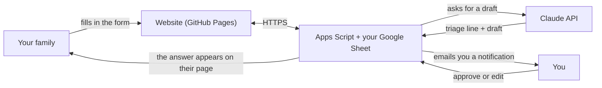

# Ask Alonso Bryan

A small private website where your family can send you the things they need help with — a computer
problem, a form, a school assignment, a spreadsheet, a little project — instead of scattering them
across WhatsApp, calls and email. Every request lands in one place. Claude writes a draft answer for
you the moment a request arrives, **but nothing is ever sent to anyone until you approve it.** You stay
the only voice they hear.

This guide is for you, the owner. It assumes no programming experience: follow the steps in order and
click exactly what they say. The whole setup takes about an hour.

## How it works



In words: a family member fills in the form → the request is stored in **your** Google Sheet → Claude
writes a one-line triage note for you and a draft reply → you read it on the admin page (or in Claude
Code) and approve or rewrite it → **your** answer appears on their page, and optionally in their email.
Claude never talks to your family directly.

## What it costs

- **Claude API (Anthropic): pay per use.** This uses the `claude-opus-5` model, billed at **$5 per
  million input tokens and $25 per million output tokens**. One draft is a page of instructions plus the
  request going in and a few hundred words coming out, so it costs **roughly a few cents**.
- **The `dailyCap` setting bounds your spending.** By default Claude writes at most 40 drafts a day.
  After that, requests simply arrive without a draft and wait for you. You can also set a monthly spend
  limit in the Anthropic Console.
- **Google (Sheets, Apps Script, Gmail) and GitHub Pages: free** for this kind of personal use.
- A Claude subscription (claude.ai) does **not** cover API usage: the API is billed separately, with
  prepaid credits. Using Claude Code for the bridge uses your normal Claude Code plan.

## What you need

- A Google account (the one that will own the Sheet and send the notification emails).
- A GitHub account (free) for the website.
- An Anthropic Console account with a little credit, for the drafts.
- For step 8 only: a computer with [Node.js](https://nodejs.org) 18 or newer and Claude Code.
- This folder (`AskAlonsoBryan`) on your computer.

---

## Step 1: Create the Google Sheet and the Apps Script project

1. Open [sheets.new](https://sheets.new) while signed in with your Google account. A blank spreadsheet opens.
2. Click **Untitled spreadsheet** (top left) and name it `Ask Alonso Bryan`.
3. In the menu, click **Extensions → Apps Script**. A new tab opens with the script editor.
4. Click **Untitled project** (top left), name it `Ask Alonso Bryan`, and click **Rename**.
5. In the file list on the left, `Code.gs` is open. Select everything in the editor (Ctrl+A, or Cmd+A on a
   Mac) and delete it.
6. On your computer, open `backend/Code.gs` from this folder in a text editor, copy **all** of it, and
   paste it into the Apps Script editor.
7. Click the **gear icon (Project Settings)** in the left sidebar. Tick
   **Show "appsscript.json" manifest file in editor**.
8. Click the **`< >` icon (Editor)** in the left sidebar. A new file, `appsscript.json`, is now in the file
   list. Click it, select everything, delete it, and paste the full contents of `backend/appsscript.json`.
9. Click the **Save project** icon (the floppy disk), or press Ctrl+S / Cmd+S.

## Step 2: Add your Anthropic API key

1. Go to [console.anthropic.com](https://console.anthropic.com) and sign in (it may take you to the Claude
   Platform site; the names below may differ slightly).
2. Under **Billing**, add some credit. Under **Limits**, you can also set a monthly spend limit.
3. Open **API keys**, click **Create key**, name it `ask-alonso-bryan`, and copy the key (it starts with
   `sk-ant-`). You will only see it once.
4. Back in Apps Script, click the **gear icon (Project Settings)** and scroll down to **Script Properties**.
5. Click **Add script property** (or **Edit script properties** if some already exist).
   - Property: `ANTHROPIC_API_KEY`
   - Value: paste the key
6. Click **Save script properties**.

> Never put the API key in any file in this folder, and never commit it to GitHub. It only lives in Script
> Properties, inside your own Apps Script project.

## Step 3: Run `setup()` and authorize the script

1. Click the **`< >` icon (Editor)** and open `Code.gs`.
2. In the toolbar above the code, open the function drop-down and choose **setup**. Then click **Run**.
3. An **Authorization required** box appears. Click **Review permissions** and choose your Google account.
4. You will probably see **"Google hasn't verified this app"**. That is normal and expected: this is *your
   own* script running in *your own* account, not an app published to the world, so nobody at Google has
   reviewed it. Click **Advanced**, then **Go to Ask Alonso Bryan (unsafe)**.
5. Review the permissions (Sheets, Gmail, external requests, triggers). If you see checkboxes, tick
   **Select all**. Then click **Allow** (or **Continue**).
6. The **Execution log** at the bottom shows the results. Copy these two values somewhere safe, such as a
   password manager:
   - the **family link token** (the part after `#f=`), and
   - the **admin token**.
   The log also lists anything still missing (API key, `siteUrl`).
7. `setup()` also created the two sheets (`Requests` and `Messages`) and installed a trigger that runs every
   minute. You can see it under the **clock icon (Triggers)**: one `tick` trigger, "Time-based, every minute".

Running `setup()` again later is safe: it never replaces existing tokens or settings.

## Step 4: Deploy the backend as a web app

1. Click **Deploy** (top right) → **New deployment**.
2. Next to **Select type**, click the **gear icon** → **Web app**.
3. Fill in:
   - Description: `v1`
   - **Execute as: Me** (your address)
   - **Who has access: Anyone**. The site and the bridge must reach it without a Google sign-in. Every
     request still needs the family token or the admin token, so "Anyone" does not mean anyone can read
     your family's messages.
4. Click **Deploy** (authorize again if asked), then copy the **Web app URL**. It ends with `/exec`.
5. Open `assets/config.js` in this folder and replace
   `https://script.google.com/macros/s/PASTE_YOUR_DEPLOYMENT_ID/exec` with your URL. Keep the quotes. Save
   the file.

> **IMPORTANT — the one thing everybody forgets.** After **any** later change to `Code.gs`, go to
> **Deploy → Manage deployments**, select your deployment, click the **pencil icon (Edit)**, set
> **Version: New version**, and click **Deploy**. Otherwise the website keeps running the old code.
> (The every-minute trigger already uses the newly saved code, so without a new version the two halves
> of your backend disagree with each other, which is confusing to debug.) The URL never changes.

## Step 5: Publish the website on GitHub Pages

1. On [github.com](https://github.com), click **+** (top right) → **New repository**.
2. Repository name: `AskAlonsoBryan`. Choose **Public** (free GitHub Pages needs a public repository).
   Click **Create repository**.
3. Upload the files, in either of two ways:
   - **In the browser:** on the new repository page, click **uploading an existing file**, drag in all the
     files and folders from `AskAlonsoBryan` (`index.html`, `admin.html`, `assets`, `backend`, `bridge`,
     `dev`, and the `.md` files), and click **Commit changes**. **Never upload `bridge/.env`.**
   - **With git:** `git init`, `git add .`, `git commit -m "Ask Alonso Bryan"`, then follow the "push an
     existing repository" commands GitHub shows. `.gitignore` already keeps `bridge/.env` and local state out.
4. In the repository, click **Settings** → **Pages** (left sidebar).
5. Under **Build and deployment**: Source **Deploy from a branch**, Branch **main**, folder **/ (root)** →
   **Save**.
6. Wait 1–2 minutes and refresh. The page shows **"Your site is live at
   https://alonbbar6.github.io/AskAlonsoBryan/"**.

> The repository is public, so anyone can read the code. That is fine: **no secrets live in it.** The API
> key and both tokens stay in Script Properties, and `assets/config.js` only holds the web app URL, which
> is useless without a token. Your family's requests are in your Sheet, never on GitHub.

## Step 6: Open the admin page and fill in Settings

1. Open `https://alonbbar6.github.io/AskAlonsoBryan/admin.html#admin=YOUR_ADMIN_TOKEN` (paste the admin
   token from step 3). The page remembers the token in this browser and removes it from the address bar.
2. Open **Settings** and fill in:

   | Setting | What to put |
   |---|---|
   | `ownerName` | How you appear to your family, e.g. `Alonso Bryan`. |
   | `siteUrl` | `https://alonbbar6.github.io/AskAlonsoBryan/` (with the trailing slash). Used to build the family link and the links in emails. |
   | `notifyEmail` | Where you want to be told about new requests. Leave empty for no emails. |
   | `notifyOn` | `new` = email me about every new request and follow-up (with the draft). `none` = don't email me. |
   | `dailyCap` | Maximum Claude drafts per day (default 40). Your spending cap. `0` turns Claude off completely: requests still arrive, you just write every answer from scratch. |
   | `defaultLang` | `es` or `en`: the language the family site opens in when the browser doesn't say. |
   | `autoDraft` | On: Claude drafts an answer as soon as a request arrives. Off: requests arrive with no draft and you ask for one per request. |
   | `emailReplies` | On: you can tick "Email the answer" when replying to someone who left an address. |

3. Save. The status strip at the top of the admin page shows whether the trigger is running and the API key
   is configured.

## Step 7: Share the family link

The link is **`siteUrl` + `#f=` + the family link token**, for example
`https://alonbbar6.github.io/AskAlonsoBryan/#f=abc123...`. The admin page can build and copy it for you.

- One link is shared with the whole family. Send it privately (a direct message, not a public group).
- **Treat it like a password.** Anyone who has it can open the site and send you requests.
- Each person still only sees **their own** requests: their browser keeps a private 32-character code that
  identifies them. The link alone does not show anyone else's messages.
- If the link ever leaks, rotate it: Apps Script → **Project Settings** → **Script Properties** →
  **Edit script properties** → delete `FAMILY_TOKEN` → **Save script properties**, then run `setup()` again
  (step 3) and copy the new token from the log. The old link stops working immediately, so send everyone the
  new one. No new deployment is needed.

## Step 8: The Claude Code bridge (optional)

This lets a Claude Code session on your computer watch for new requests. It summarizes each one in English,
proposes a reply in the family member's own language, and posts it **only after you approve its exact text**.

1. In this folder, copy the example settings file: `cp bridge/.env.example bridge/.env`
2. Open `bridge/.env` in a text editor and set:
   - `ASK_API_URL=` your web app URL from step 4 (ending in `/exec`)
   - `ASK_ADMIN_TOKEN=` your admin token from step 3
3. Test it: `node bridge/inbox.mjs` should list your requests (or say there are none).
4. Open Claude Code in this folder (`cd AskAlonsoBryan`, then `claude`) and say:
   **"watch for new family requests"**.
5. Keep the session open. When something arrives, Claude tells you who wrote and what they need, shows a
   proposed reply, and waits for you to approve, edit or skip it. Claude Code may ask permission to run the
   `node bridge/...` commands. Allowing them is fine.

The rules the session follows are in `CLAUDE.md` — the most important one being that it never sends anything
you have not approved word for word. `bridge/.env` holds your admin token: it is gitignored, and you should
never share it or paste it into a chat.

---

## Local testing (no accounts needed)

```
node dev/server.mjs
```

This runs the real backend code on your computer with fake Google services and serves the site at
**http://localhost:8788**. (Port 8788, not 8787, so it can run at the same time as the tutor-zoila project.)
It prints ready-made links for the family page and the admin page. The `bridge/.env.example` values already
point at it, so `cp bridge/.env.example bridge/.env` is enough to try the bridge locally.

Run the automated tests from the repo root with:

```
node --test
```

(`node --test dev/*.test.mjs` also works. Don't pass the bare folder `dev/`: Node 24 treats it as a module
path and fails.)

## Rotating the link or tokens

- **New family link:** Apps Script → **Project Settings** → **Script Properties** → **Edit script
  properties** → delete `FAMILY_TOKEN` → **Save script properties**. Then run `setup()` again (step 3) and
  copy the new token from the log. The old link stops working right away; send everyone the new one.
- **New admin token:** same steps with `ADMIN_TOKEN`. Then open `admin.html#admin=NEW_TOKEN` again and
  update `ASK_ADMIN_TOKEN` in `bridge/.env`.
- **New Anthropic key:** create a new key in the Console, replace the `ANTHROPIC_API_KEY` value in Script
  Properties, then delete the old key in the Console.

None of these need a new deployment.

## Troubleshooting

| What you see | Likely cause | What to do |
|---|---|---|
| The site says it is **not connected** | `assets/config.js` still has `PASTE_YOUR_DEPLOYMENT_ID`, or GitHub Pages has not updated yet | Paste the `/exec` URL (step 4), commit, wait 1–2 minutes, and reload with Ctrl+Shift+R / Cmd+Shift+R. |
| **Unauthorized** on the family site | The link is wrong, incomplete or was rotated | Send the current link from the admin page. The part after `#f=` must be complete. |
| **Unauthorized** on the admin page or in the bridge | Wrong admin token | Open `admin.html#admin=TOKEN` again, or fix `ASK_ADMIN_TOKEN` in `bridge/.env`. |
| A family member says **their list is empty** | They cleared their browser data, or opened the link on a different device | Their list is tied to a code stored in their browser. If they kept it, they can paste it into "I have a code" on the site. Otherwise they start a new list; the old requests are still in your Sheet and on the admin page. |
| **No drafts are being written** | The trigger isn't running, the API key is missing or invalid, credit ran out, the daily cap was reached, or drafting keeps failing | Look at the admin **status strip**: if `lastTickAt` is old, check **Triggers** in Apps Script (run `setup()` again). If the API key shows not configured, redo step 2. Read **lastError** (for example an invalid key or low credit). Check the cap. In Apps Script, open **Executions** (left sidebar) to see failed runs. You can always answer without a draft. |
| **The draft is about an older message** | A follow-up arrived after the draft was written | The admin page and the bridge both warn about this. Click **Draft with Claude** again, or just write the answer yourself. |
| **Code changes aren't live** | No new deployment version | **Deploy → Manage deployments → Edit (pencil) → Version: New version → Deploy.** For site files, wait for GitHub Pages and hard-reload. |
| The bridge says Google showed a **sign-in page** | Web app access isn't "Anyone" | **Deploy → Manage deployments → Edit →** Who has access: **Anyone**. |
| The bridge says **not configured** | No `bridge/.env` | Do step 8. |
| **"Google hasn't verified this app"** | Normal for your own script | **Advanced → Go to Ask Alonso Bryan (unsafe)** (step 3). |
| Errors like "You do not have permission to call …" | The script needs new permissions after an update | Run `setup()` again in the editor and allow the permissions. |
| **Too many requests / rate limited** | Someone sent more than 20 messages in an hour | It clears by itself within the hour. |

## Privacy notes

- **Where the data lives:** every request and every message is a row in **your** Google Sheet, in your
  Google account. Notification emails are in your Gmail. Nothing is stored on GitHub — the repository only
  holds the code of the website.
- **Each person's list is tied to a code in their browser.** The first time someone opens the family link,
  their browser generates a random 32-character `requesterId` and keeps it in that browser's local storage.
  That code is what the server uses to show them their own requests and nobody else's. It also means: a new
  browser or a cleared browser starts an empty list, and anyone using their device can see their list. The
  site offers a "copy my code" button and an "I have a code" field so they can move their list to another
  device — that code should be treated like a password too.
- **Who sees what:** you see everything (admin page, the Sheet, your Gmail). A family member sees only their
  own requests. Family members never see each other's requests, your triage lines, or any draft — drafts and
  triage notes exist only for you, and only the text you approve is ever shown to them.
- **Claude sees the request text.** To write a triage line and a draft, the request and the conversation so
  far are sent to Anthropic's API from your Apps Script project. See Anthropic's commercial terms and privacy
  policy for how API data is handled. When you use the bridge, the same text also appears in your Claude Code
  session on your computer.
- **The links are keys:** the family link and the admin token work like passwords. The part after `#` is
  never sent to GitHub's servers, and the pages remove it from the address bar after the first visit. Rotate
  a token if it leaks.
- **No sensitive data, by design:** the family form says not to send passwords, card numbers or ID numbers,
  and Claude is instructed never to ask for them and to push back if someone pastes one anyway.
- **Deleting:** you can delete a request from the admin page. Deleting the Google Sheet removes all stored
  requests and messages. To shut everything down, archive the deployment (**Deploy → Manage deployments →
  Archive**) and delete the trigger.
